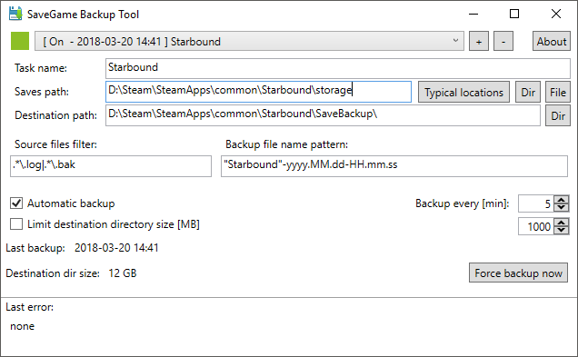
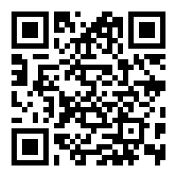

# SaveGame Backup Tool (SGBT) #

# README #

## Links ##

* Download - https://github.com/sebeksd/SaveGame-Backup-Tool/releases
* Surcecode - https://github.com/sebeksd/SaveGame-Backup-Tool
* Issues and feature requests - https://github.com/sebeksd/SaveGame-Backup-Tool/issues

## Description ##
Initially this application was created for myself because I couldn't find any similar app and I need one.  
Main purpose of this application is to make backup of Games Saves, especially for games with one "save slot" that overwrites itself automatically. 
There are of course other situation that this app is perfect for, read "Use cases / scenarios" to know more.

In some cases backuping your save could be treated as cheating (by yourself or others) but on the other hand I hate when game do something illogical
and unpredictable.

This app has few nice features (e.g. backup only if files changed) so please read "How it works" section!
If you like this app go to **"Donation"** section :)

### Use cases / scenarios ###

* #### Peace of Mind ####
Starbound has only one "current state" but you can use it to play multiplayer, bad thing about this is that you have no control  
over other players that you join party, they can teleport to your Ship and destroy it. In this situation you will fear to join any party.
Bad stuff could happen even if you play with some younger family member (who will destroy everything for fun).
To fight that problem you can either do a manual backup or use this application.

* #### Quick Saves (especially for games with one QS slot) ####
You can select single "Quick Save" file to backup every minute, in result you will get multiply Quick Saves.
This is especially useful when you usually do QS very often, now you will not lose QS made in good moment which QS in bad moment.

* #### Autosaves in one Slot ####
You can select whole folder (games of this kind usually have one folder with few files) to do backup every e.g. 5 minutes. 
When game do something that you thing was illogical or unconscionable you can restore previous save.

### How it works ###

#### Modes ####
Configure a task and then:

* use it manually by pressing "Force backup now"
* select automatic backup and frequency

#### Backup destination ####
Backup is created as one zip file in destination directory (directory will be created if it doesn't exists), 
name of the file will be created based on "Backup file name pattern". You can select file or directory.

#### When backup is created ####
Backup will be created only if files are not locked for reading, in some cases you will need to close a game.  
In case of automatic backup application will create backup only when configured time passes and if file/files did change so
you can run this application all the time in background with automatic backup activated.  
Some games (e.g. Starbound) can have some frequently changed files (like log files), you can add this files to ignored pattern
so they will not affect modified files scan and also they will not be placed in backup zip.

#### Commandline ####
Application has few command line options:

* -t: run in tray
* -b=TaskName: make quick backup by task name
* -h: display command line help

#### Settings location ####
Application saves settings to "Settings.xml" file in application installation directory, Settings are saved every time you close the SGBT.

## Requirements / known issues ##
* to run this application you need to have .NET Framework 4.5.2
* if you are using MSI Afterfurner (version 4.3 mayby other versions to) application can crash on startup, this is problem with MSI Afterburner it will crash many C# WPF applications (MSI A. beta 4.4 works fine)

## Issues and Features requests ##

You can report an issue or make feature request throug Issues tab on Bitbucket

## Contribution guidelines ##

Make a fork of this repository, make your changes then create pull request

## License and Disclaimer ##

   SaveGame Backup Tool -  Application for automatic Games Saves backup  
   Copyright (C) 2017 sebeksd  

   This program is free software; you can redistribute it and/or modify  
   it under the terms of the GNU Lesser General Public License as published by  
   the Free Software Foundation; either version 3 of the License, or  
   (at your option) any later version.  
   
   This program is distributed in the hope that it will be useful,  
   but WITHOUT ANY WARRANTY; without even the implied warranty of  
   MERCHANTABILITY or FITNESS FOR A PARTICULAR PURPOSE.  See the  
   GNU Lesser General Public License for more details.  

   You should have received a copy of the GNU Lesser General Public License  
   along with this program; if not, write to the Free Software Foundation,  
   Inc., 51 Franklin Street, Fifth Floor, Boston, MA 02110-1301  USA  

## Donation ##
If you like this app and you think it is worth of your money or you just have to much money, feel free to donate to my Bitcoin Address :)

Bitcoin address: 1B3TSZx38u1gRT6B7UN156oiUJNkKvGb56